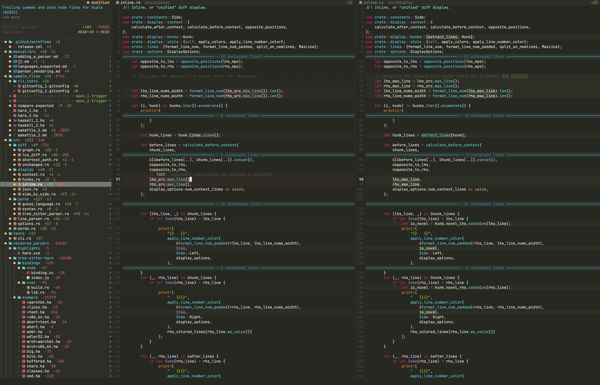

# `difftastic.nvim`

A Neovim plugin that displays [`difftastic`](https://github.com/Wilfred/difftastic)'s structural diffs in a side-by-side
view with syntax highlighting.

<p align="center">
  
</p>

## Features

- Side-by-side diff view with synchronized scrolling
- Hierarchical file tree sidebar with directory collapsing
- Syntax highlighting for the source language
- Filler lines to visually indicate alignment gaps
- Support for both [jj](https://github.com/martinvonz/jj) and [git](https://git-scm.com/) version control
- Optional snacks.nvim picker for selecting a revision/commit

## Installation

### Requirements

- Neovim 0.10+
- [nui.nvim](https://github.com/MunifTanjim/nui.nvim)
- [difftastic](https://github.com/Wilfred/difftastic) (`difft` command)
- [jj](https://github.com/martinvonz/jj) or [git](https://git-scm.com/) version control
- Rust toolchain (only if building from source)
- [snacks.nvim](https://github.com/folke/snacks.nvim) (optional, only for `:DifftPick`)

### lazy.nvim (recommended)

```lua
{
    "clabby/difftastic.nvim",
    dependencies = {
        "MunifTanjim/nui.nvim",
        -- optional: only needed for :DifftPick
        "folke/snacks.nvim",
    },
    config = function()
        require("difftastic-nvim").setup({
            download = true, -- Auto-download pre-built binary
            snacks_picker = {
                enabled = true,
            },
        })
    end,
}
```

### Building from source

If you prefer to build locally or pre-built binaries aren't available for your platform:

```lua
{
    "clabby/difftastic.nvim",
    dependencies = { "MunifTanjim/nui.nvim" },
    config = function()
        require("difftastic-nvim").setup()
    end,
}
```

Requires a Rust toolchain. The plugin automatically builds from source on first use if the library isn't found.

## Usage

### Commands

| Command | Description |
|---------|-------------|
| `:Difft` | Open diff view for unstaged changes (git) or uncommitted changes (jj) |
| `:Difft --staged` | Open diff view for staged changes (git only) |
| `:Difft <ref>` | Open diff view for a jj revset or git commit/range |
| `:DifftPick` | Pick a jj revision or git commit using snacks.nvim (with preview) |
| `:DifftPickRange` | Pick end revision, then pick a parent revision as range start |
| `:DifftClose` | Close the diff view |
| `:DifftToggleReviewed` | Toggle the reviewed mark of the shown file (in the tree: of the row under the cursor) |
| `:DifftUpdate` | Update to latest release (requires `download = true`) |

### Examples (jj)

```vim
" Diff uncommitted changes (working copy vs @)
:Difft

" Diff the current change
:Difft @

" Diff the parent of the current change
:Difft @-

" Diff a change-id prefix (equivalent to jj diff -r w)
:Difft w

" Diff a specific revision
:Difft abc123
```

### Examples (git)

```vim
" Diff unstaged changes (working tree vs index)
:Difft

" Diff staged changes (index vs HEAD)
:Difft --staged

" Diff the last commit
:Difft HEAD

" Diff a specific commit
:Difft abc123

" Diff a commit range
:Difft main..HEAD
```

## Keybindings

All keybindings are buffer-local and configurable via `setup()`. Defaults:

| Key | Action |
|-----|--------|
| `]f` | Next file |
| `[f` | Previous file |
| `]c` | Next hunk |
| `[c` | Previous hunk |
| `<Tab>` | Toggle focus between file tree and diff |
| `<CR>` | Open file under cursor (in file tree) and focus its diff pane (see `focus_diff_on_select`) |
| `gf` | Go to file at cursor position (opens in previous tab or new tab) |
| `R` | Toggle the reviewed mark of the shown file; in the tree, of the file or directory under the cursor |
| `]u` / `[u` | Next / previous file not marked as reviewed |
| `q` | Close diff view |
| Double-click the split between the diff panes | Give both panes the same width |
| Double-click the side panel's right border | Reset the panel to `tree.width` |

The `gf` keymap works from the right pane (new/working version) and jumps to the corresponding line and column in an editable buffer. If on a filler line, it jumps to the nearest non-filler line.

Filler lines (`╱╱╱`) indicate where content exists on one side but not the other.

## Configuration

```lua
require("difftastic-nvim").setup({
    download = false,              -- Auto-download pre-built binary (default: false)
    vcs = "jj",                    -- "jj" (default) or "git"
    highlight_mode = "treesitter", -- "treesitter" (default) or "difftastic"
    hunk_wrap_file = true,          -- Next hunk at last hunk goes to next file
    scroll_to_first_hunk = true,  -- Auto-scroll to first hunk when a file is first opened (default: true)
    focus_diff_on_select = true,  -- Move focus to the diff pane after selecting a file in the tree (default: true)
    auto_review = false,          -- Mark a file as reviewed when it is shown (default: false)
    max_parallel_difft_calls = 0, -- Files one diff processes at once; 0 = one per CPU (default: 0)
    context_size = 3,             -- Unchanged lines kept around each change; the rest is folded. 0 turns folding off (default: 3)
    min_fold_size = 2,            -- Smallest run of unchanged lines that gets folded (default: 2)
    fold_by_default = true,       -- Whether those folds start closed (default: true)
    fold_fill = "━",              -- Character of the rule across a closed fold (default: "━")
    fold_accent = "Directory",    -- Highlight group whose colour closed folds take (default: "Directory")
    snacks_picker = {
        enabled = false,          -- opt-in snacks.nvim integration (default: false)
        limit = 200,              -- number of revisions/commits to list in :DifftPick
        jj_log_revset = nil,      -- optional: jj revset for picker log (nil = omit -r and use jj default)
    },
    keymaps = {
        next_file = "]f",
        prev_file = "[f",
        next_hunk = "]c",
        prev_hunk = "[c",
        close = "q",
        focus_tree = "<Tab>",
        focus_diff = "<Tab>",
        select = "<CR>",
        goto_file = "gf",
        toggle_reviewed = "R",
        next_unreviewed = "]u",
        prev_unreviewed = "[u",
    },
    tree = {
        width = 40,
        icons = {
            enable = true,    -- use nvim-web-devicons if available
            dir_open = "",
            dir_closed = "",
            unvisited = "•",  -- review marker: file not shown yet
            reviewed = "✓",   -- review marker: file marked as reviewed
        },
    },
    highlights = {
        -- Override any highlight group (see Highlight Groups below)
        -- DifftAdded = { bg = "#2d4a3e" },
    },
})
```

All options are optional. Only specify what you want to override.

### Highlight Modes

The `highlight_mode` option controls how syntax highlighting is applied:

- **`treesitter`** (default): Full syntax highlighting via Neovim's treesitter. Changes are shown with background colors.
- **`difftastic`**: Minimal highlighting like the CLI. No syntax colors; changes are shown with foreground colors (green/red) to make diffs more prominent.

## Highlight Groups

Highlights automatically inherit from your colorscheme's semantic groups (`Added`, `Removed`, `Directory`, `Normal`) and update when you switch themes. Strong background colors are derived by blending the foreground color with your `Normal` background at 38% opacity. Line background colors use half of that opacity for a lighter full-line context.

**Treesitter mode** (background colors):

| Group | Default | Description |
|-------|---------|-------------|
| `DifftAdded` | Derived from `Added` | Added lines background |
| `DifftRemoved` | Derived from `Removed` | Removed lines background |
| `DifftAddedLine` | Derived from `Added` | Lighter added line background |
| `DifftRemovedLine` | Derived from `Removed` | Lighter removed line background |

**Difftastic mode** (foreground colors):

| Group | Default | Description |
|-------|---------|-------------|
| `DifftAddedFg` | `Added` + bold | Added text |
| `DifftRemovedFg` | `Removed` + bold | Removed text |

**Tree**:

| Group | Default | Description |
|-------|---------|-------------|
| `DifftDirectory` | Links to `Directory` | Directory names |
| `DifftTreeDirectory` | Links to `Directory` | Directory labels in the tree |
| `DifftTreeFile` | Derived from `Normal` | File names in the tree |
| `DifftFileAdded` | Links to `Added` | Added files |
| `DifftFileDeleted` | Links to `Removed` | Deleted files |
| `DifftTreeAdded` | Links to `Added` | Added status marker |
| `DifftTreeDeleted` | Links to `Removed` | Deleted status marker |
| `DifftTreeModified` | Derived from `Changed`/`Identifier` | Modified status marker |
| `DifftTreeRenamed` | Links to `Directory` | Renamed status marker |
| `DifftTreeReviewed` | Links to `Added` | Reviewed file marker |
| `DifftTreeUnvisited` | Links to `Directory` | Marker of a file not shown yet |
| `DifftTreeMuted` | Derived from `Comment` | Tree hints and separators |
| `DifftTreeIndent` | Derived from `Comment` | Tree indent guide |
| `DifftTreeChevron` | Derived from `Comment` | Directory expand/collapse chevron |
| `DifftTreeTitle` | Derived from `Normal` | Tree header title |
| `DifftTreeDivider` | Derived from `Comment` | Tree header divider |
| `DifftTreeRange` | Links to `BlueItalic` | Tree header revset/base-head value |
| `DifftTreeNormal` | Derived from `Normal` | Tree panel background |
| `DifftTreeCursorLine` | Derived from `Normal` | Tree cursorline background |
| `DifftTreeCurrent` | Derived from `Normal` | Current file highlight |

**Picker**:

| Group | Default | Description |
|-------|---------|-------------|
| `DifftPickerPreviewHover` | Derived from `Normal` | Hovered jj revision lines in picker preview |
| `DifftPickerJjIconCurrent` | Links to `Added` | `@` icon in jj picker list |
| `DifftPickerJjIconImmutable` | Links to `Removed` | `◆` icon in jj picker list |
| `DifftPickerJjIconNormal` | Links to `Directory` | `○` icon in jj picker list |
| `DifftPickerJjDesc` | Derived from `Normal` | Description text in jj picker list |
| `DifftPickerJjRevset` | Links to `Identifier` | Change/revset id in jj picker list |
| `DifftPickerJjAge` | Links to `Comment` | Age field in jj picker list |

**Other**:

| Group | Default | Description |
|-------|---------|-------------|
| `DifftFiller` | Derived from `Normal` | Filler lines for alignment gaps |
| `DifftFold` | Derived from `fold_accent` (`Directory`) | Band and text of a closed fold of unchanged lines (used for `Folded` in the diff panes) |

## License


[MIT](./LICENSE.md)
